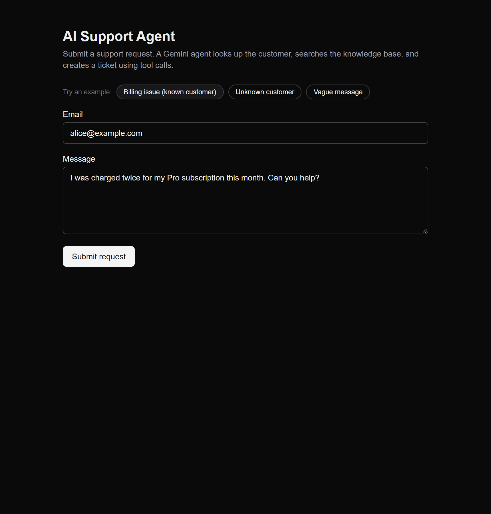
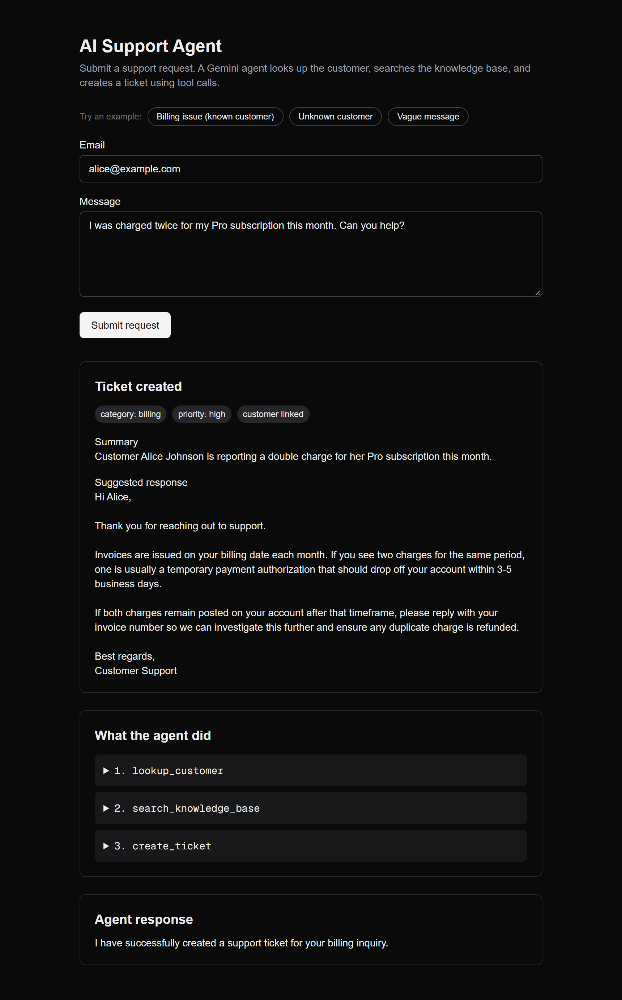
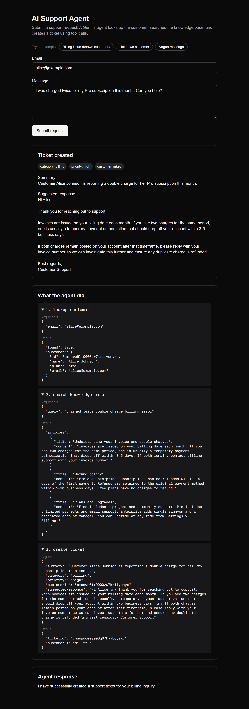
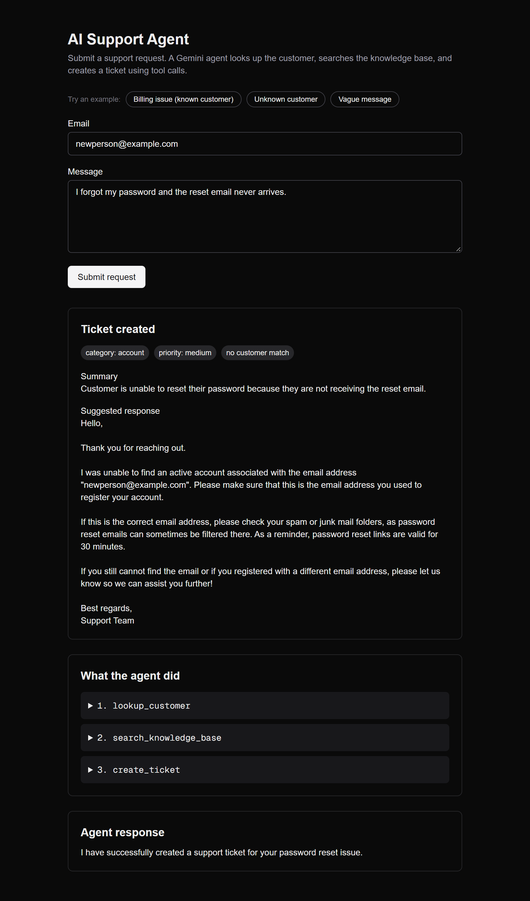
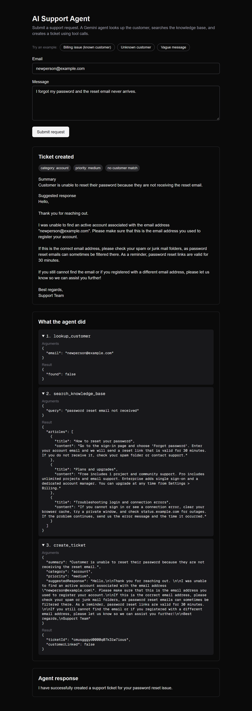

# AI Support Agent

A small demo of a **Gemini agent that uses function calling**. A customer submits a support request; the agent decides which tools to call, the tools run against a real PostgreSQL database, and the result is a stored support ticket plus a visible trace of every tool call the agent made.

**Live demo:** https://ai-support-agent-one-tau.vercel.app/

**Stack:** Next.js 16 (App Router) · React · TypeScript · Tailwind CSS · PostgreSQL · Prisma 7 · Gemini API (`@google/genai`) · Zod

## Screenshots

| Request | Ticket | Tool calls |
| --- | --- | --- |
|  |  |  |
| |  |  |

## How it works

```
Support request (email + message)
        │
        ▼
POST /api/agent ── validates input with Zod
        │
        ▼
Gemini (generateContent, function declarations)
   ▲        │ functionCall
   │        ▼
   │   Tool runs against Postgres
   │     • lookup_customer       → Customer table
   │     • search_knowledge_base → KnowledgeArticle table
   │     • create_ticket         → Ticket table
   │        │
   └────────┘ functionResponse (repeat until the model stops calling tools)
        │
        ▼
Ticket + tool-call trace + final reply, shown on the page
```

The model decides **which** tools to call and **in what order**, and it supplies the ticket's category, priority, summary, and suggested response as the arguments of `create_ticket`. The application code only runs the loop and executes the tools; it does not classify or route anything itself.

## Design notes

- **Manual function-calling loop** ([src/lib/agent.ts](src/lib/agent.ts)). Automatic function calling is disabled so each step is explicit and recorded. The loop is capped at 5 steps.
- **Thought signatures.** Each model turn is replayed to Gemini unchanged, which preserves Gemini 3 thought signatures across turns.
- **One schema per tool** ([src/lib/schemas.ts](src/lib/schemas.ts), [src/lib/tools.ts](src/lib/tools.ts)). The Zod schema generates the Gemini function declaration (`z.toJSONSchema` → `parametersJsonSchema`) and also validates the model's arguments before the tool runs.
- **Errors go back to the model.** Invalid arguments or an unknown tool return an `{ error }` result, so the model can correct itself. The failed call still appears in the trace.
- **The model never supplies the customer's original email or message.** `create_ticket` stores those from the validated request.
- **Typed failures.** `ConfigError` (missing API key) maps to 500, and `AgentError` (no ticket created) and upstream Gemini errors map to 502. Upstream error details are logged on the server, not returned to the client.
- **The trace is persisted** in `Ticket.toolCalls` (JSON).

## Getting started

Requires Node.js 20.9+, npm, and Docker.

```bash
npm install
docker compose up -d          # PostgreSQL on localhost:5432

cp .env.example .env          # then set GEMINI_API_KEY in .env
npm run db:generate           # generate the Prisma client
npm run db:migrate            # create the tables
npm run db:seed               # 3 customers + 5 knowledge-base articles

npm run dev                   # http://localhost:3000
```

On Windows PowerShell, use `Copy-Item .env.example .env` instead of `cp`.

### Environment variables

| Variable | Purpose |
| --- | --- |
| `DATABASE_URL` | Postgres connection string (the default matches `docker-compose.yml`) |
| `GEMINI_API_KEY` | Your Gemini API key |
| `GEMINI_MODEL` | Model name, default `gemini-3.5-flash` |

## Try it

The page has three example buttons. The seed data contains these customers:

| Email | Plan |
| --- | --- |
| `alice@example.com` | pro |
| `bob@example.com` | free |
| `carol@example.com` | enterprise |

Any other email is treated as an unknown customer and still gets a ticket. Each result shows the ticket (category, priority, summary, suggested response), the ordered tool calls with their arguments and results, and the agent's final reply.

## Tests

```bash
docker compose up -d && npm run db:seed   # the tests read the seeded data
npm test
```

Tests use Node's built-in test runner through `tsx` and the local Docker database. They never call the real Gemini API: the Gemini HTTP endpoint is replaced by a scripted fake, so the real SDK request and response handling still runs. The tests force a dummy API key and block all other network access. Tickets created by tests are removed after each test, even when a test fails.

Covered: Zod schemas, each tool against the seeded data, the agent loop (tool order, trace persistence, thought-signature replay, error recovery, step limit, missing key, upstream failure), and the route's status codes.

## Project structure

```
prisma/schema.prisma      Customer, KnowledgeArticle, Ticket
prisma/seed.ts            fictional demo data
src/lib/schemas.ts        Zod schemas (request input, tool arguments)
src/lib/tools.ts          function declarations + tool implementations
src/lib/agent.ts          the Gemini function-calling loop
src/app/api/agent/route.ts   POST /api/agent
src/app/page.tsx          the one-page UI
tests/                    node:test suites
```

## Limitations

- Knowledge-base search is simple keyword matching, not embeddings or RAG. It is enough for five articles.
- No authentication, rate limiting, or ticket history UI; this is a focused demo of tool calling.
- The agent is a single model with three tools, with no multi-agent orchestration.
